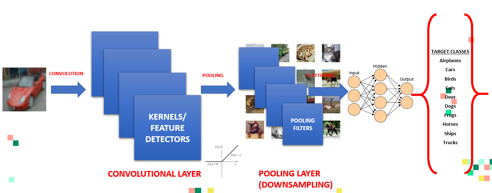

# CiFAR-10 Images Classification Using CNNs

# Ahmed Humayun

The project aims to use CNNs to classify different images into labels including different animals and objects.

Convolutional Neural Networks -

   - Convolutions use a kernel matrix to scan a given image and apply a filter to obtain a certain effect.

   - An image Kernel is a matrix used to apply effects such as blurring and sharpening.

   - Kernels are used in machine learning for feature extraction to select most important pixels of an image.

   - Convolution preserves the spatial relationship between pixels.

   

   - CIFAR-10 is a dataset that consists of several images divided into the following 10 classes:
        Airplanes
        Cars
        Birds
        Cats
        Deer
        Dogs
        Frogs
        Horses
        Ships
        Trucks

   - The dataset stands for the Canadian Institute For Advanced Research (CIFAR)

   - CIFAR-10 is widely used for machine learning and computer vision applications.

   - The dataset consists of 60,000 32x32 color images and 6,000 images of each class.

   - Images have low resolution (32x32).

   - Data Source: https://www.cs.toronto.edu/~kriz/cifar.html

Ref-

   - Photo Credit: https://commons.wikimedia.org/wiki/File:Artificial_neural_network.svg

